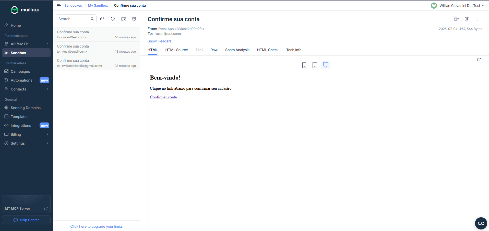

# CRUD de Eventos com Autenticação JWT

Projeto backend + frontend para cadastro, login, confirmação de conta via e-mail (mock com Mailtrap), CRUD de eventos com autenticação via JWT e documentação Swagger.

---

## Tecnologias usadas

- Node.js + Express  
- MySQL 8 (via Docker)  
- JWT para autenticação  
- Mailtrap para mock de envio de e-mails  
- Swagger para documentação da API  
- Frontend simples em HTML/CSS/JS puro  
- Vitest para testes unitários  

---

## Como rodar o projeto

### Pré-requisitos

- Docker e Docker Compose instalados  
- Conta gratuita no [Mailtrap](https://mailtrap.io/) (para visualizar e-mails)  

---

### Configuração das variáveis de ambiente

Copie o arquivo `.env.example` para `.env` dentro da pasta `backend` e preencha as variáveis com os dados do seu ambiente:

```env
DB_HOST=localhost
DB_USER=root
DB_PASSWORD=root
DB_NAME=crud072
PORT=3000
JWT_SECRET=sua_chave_secreta
EMAIL_HOST=smtp.mailtrap.io
EMAIL_PORT=2525
EMAIL_USER=SEU_USUARIO_MAILTRAP
EMAIL_PASS=SUA_SENHA_MAILTRAP
```

> Ajuste os valores conforme seu banco e Mailtrap.

---

### Passos para rodar

1. Clone o repositório:

```bash
git clone <URL-do-repositório>
cd <pasta-do-projeto>
```

2. Configure o `.env` conforme acima.

3. Suba os containers com Docker Compose:

```bash
docker compose up --build
```

Isso vai subir o banco MySQL, o backend e preparar o ambiente.

---

### Acessando a aplicação

- Backend rodando em: `http://localhost:3000`  
- Swagger da API: `http://localhost:3000/docs`  
- Frontend (events, login, register): `http://localhost:3000/`  

---
### Nota sobre autenticação na documentação Swagger

A API usa autenticação via JWT (Bearer token). Para testar os endpoints protegidos na interface do Swagger, é necessário clicar no botão Authorize no canto superior direito da página, e então inserir o token JWT gerado após o login.

#### 🚨 ATENÇÃO 🚨

Sem inserir o token neste campo, as requisições que exigem autenticação retornarão erro 401.

---

## Testando o fluxo de e-mail com Mailtrap

- Quando criar um usuário via frontend ou API, um e-mail de confirmação será "enviado" ao Mailtrap (não ao e-mail real).  
- Para visualizar o e-mail:
  - Entre na sua conta Mailtrap: https://mailtrap.io/  
  - Abra a inbox configurada (geralmente "Default Inbox")  
  - Veja o e-mail de confirmação e clique no link para ativar a conta.
  

  

---

## Como rodar os testes

**Para rodar os testes unitários, entre na pasta `backend` e execute:**
1. entre na pasta
```bash
cd backend
```

2. execute o comando 
```bash
npm run test
```

Ou, se estiver usando Docker Compose:

```bash
docker compose exec -e NODE_ENV=test backend npx vitest
```

**Se quiser ver o coverage entre na pasta `backend`**

1. entre na pasta
```bash
cd backend
```

2. execute o comando 
```bash
npm run test:coverage
```

Ou, se estiver usando Docker Compose:

```bash
docker compose exec -e NODE_ENV=test backend npx vitest --coverage
```

---

## Rotas principais

- `/users/register` - Criar usuário  
- `/users/confirm?token=xxx` - Confirmar conta  
- `/users/login` - Login e obtenção do token JWT  
- `/events` - CRUD de eventos (com autenticação)  

---

## Observações

- O sistema limita tentativas de login para evitar brute-force.  
- Autenticação via token JWT obrigatório para eventos.  
- Frontend simples para testes básicos e demonstração.


